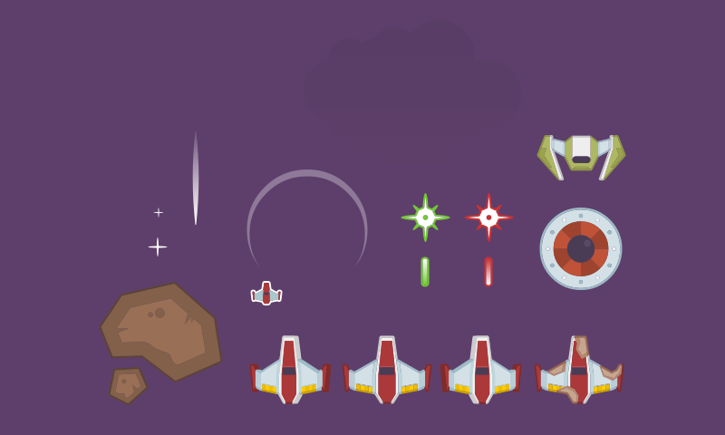
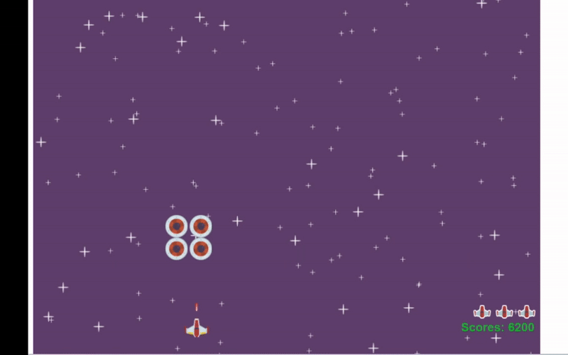
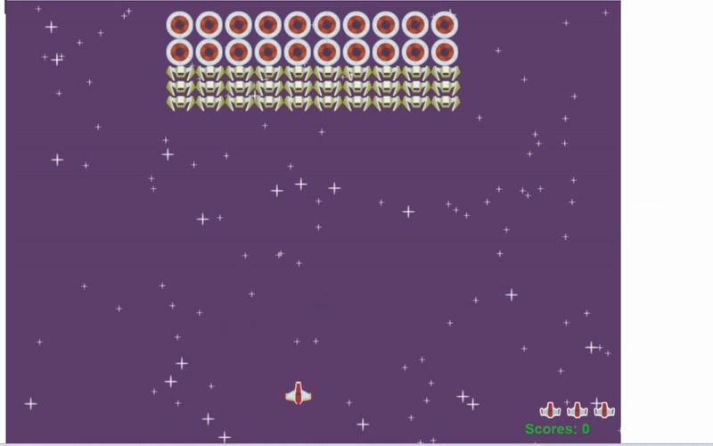
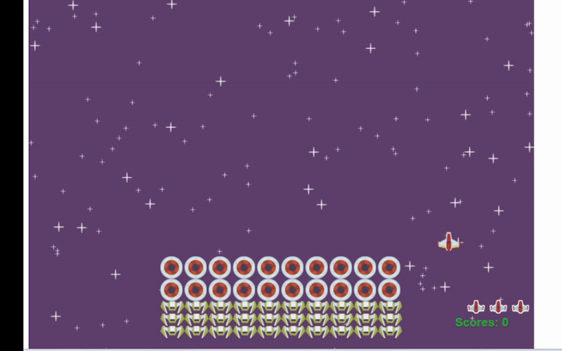

# Space Invaders



## About

Space Invaders is a classic two-dimensional shooter game where the player controls a spaceship, moving it freely on the screen to fire at descending aliens. The objective is to defeat five rows of ten aliens that advance towards the bottom of the screen. The player earns points by shooting the aliens and loses when all lives are killed or when aliens reach the bottom of the screen.

## Technical Implementation

This project was developed following the guidance from Microsoft's Web-Dev-For-Beginners curriculum. The game is built using JavaScript and the HTML5 Canvas API, showcasing fundamental web development skills and game development concepts.

### Key Features

- **Object-Oriented Design**: The game utilizes JavaScript classes to represent various game entities, such as the player, enemies, and lasers. This modular approach enhances code readability and maintainability.

- **Game Loop**: A continuous game loop is implemented using `requestAnimationFrame`, ensuring smooth rendering and updates of game objects.

- **Event Handling**: Keyboard events are captured to control the player's spaceship movements and actions, providing an interactive gaming experience.

- **Pub-Sub Pattern**: Use `EventEmitter` class to let game objects subscribe an message, and send the message when the corresponding event is captured, enhancing modularity and scalability.

- **Collision Detection**: The game includes logic to detect collisions between lasers and enemies, as well as between enemies and the player, enabling appropriate responses like scoring points or losing lives.

- **Asset Management**: Images and other assets are preloaded to ensure efficient rendering during gameplay.

### Code Structure

- `app.js`: Contains the core game logic, including class definitions for game entities, event listeners, the game loop, and collision detection mechanisms.

- `index.html`: Sets up the HTML5 canvas and includes the necessary scripts and styles.

- `package.json`: Manages project dependencies and scripts, facilitating easy setup and development.

## How to Play

- **Movement**: Use the arrow keys to move the spaceship left or right.
- **Shooting**: Press the spacebar to fire lasers at the aliens.
- **Objective**: Destroy all aliens before they reach the bottom of the screen or collide with your spaceship.
- **Lives**: The player starts with three lives. A life is lost if an alien collides with the spaceship or reaches the bottom.
- **Game Over**: The game ends when all lives are lost or all aliens are destroyed.

## Features

- **Classic Gameplay**: Experience the nostalgic feel of the original Space Invaders game.
- **Score Tracking**: Keep track of your score based on the number and type of aliens destroyed.
- **Lives Indicator**: Displays the remaining lives of the player.

## Installation

1. Clone the repository:
   ```bash
   git clone https://github.com/HiT-T/Space-Invaders.git
2. Navigate to the project directory:
    ```bash
    cd Space-Invaders
3. Install dependencies:
    ```bash
    npm install
4. Start the game:
    ```bash
    npm start
This will launch the game in your default web browser.

## Gameplay Videos

### Victory Screen



### Defeat by Collision



### Defeat by Alien Reaching Bottom



## License
This project is licensed under the MIT License. See the [LICENSE](LICENSE) file for details.

## Acknowledgments
- Developed following the Web-Dev-For-Beginners curriculum by Microsoft.
- Special thanks to the open-source community for assets and resources.
